# Wasteland Exchange — 게임 서비스 백엔드 포트폴리오

[](https://github.com/HanHyunsoo/ItemMarket/actions/workflows/ci.yml)

**아포칼립스/익스트랙션 슈터 세계관의 실시간 아이템 거래소(주문서 매칭 엔진)** — 게임 서비스 백엔드
역량을 보여주기 위한 1인 포트폴리오입니다. 핵심은 **아웃게임 거래소**입니다: 주문서 매칭 엔진을
**Microsoft Orleans(액터 모델)** 로 구현해 동시 주문 경쟁을 **락 코드 0줄**로 직렬화하고, 체결을
**에스크로 + 단일 Postgres 트랜잭션**으로 원자 정산하며, 고부하 동시성에서 **돈·아이템 보존을
SQL 불변식으로 증명**합니다. 실시간 호가/체결 푸시는 SignalR(+Redis 백플레인)로.

거래소가 진공에서 놀지 않도록, **익스트랙션 레이드 루프**를 아이템의 **공급원·소각처(경제 엔진)** 로
얇게 붙였습니다 — 레이드로 아이템이 유입되고, 수수료·사망·확장으로 소각돼 거래에 판돈이 생깁니다.

`C# / .NET 10` · `Orleans` · `PostgreSQL` · `SignalR` · `Redis` · `Vue 3` ·
**테스트 124개** · **부하 테스트로 데드락 발견 → p99 5.5× 개선**

> 평가자용 3줄 요약: (1) 매칭 동시성을 Orleans 단일 활성화로 **락 없이** 해결하고 "동시 매수 8건 →
> 1건만 체결"을 테스트로 고정. (2) 에스크로 + 단일 트랜잭션 정산으로 이중판매·복제·무한발행을 차단하고
> 부하 중 **보존 불변식**을 SQL로 검증. (3) 자작 부하 도구로 **교차-grain 데드락을 발견해 p99를
> 973→175ms로 개선**, 핫그레인은 가격밴드 샤딩으로 2.2× 돌파.

---

## 데모

라이브 앱을 Playwright로 녹화한 실동작 GIF입니다 (재현: [`tools/screenshots`](tools/screenshots)).

<table>
<tr>
<td width="50%"><b>실시간 체결(거래소 핵심)</b> — 매도 호가를 넘는 매수 주문을 넣으면 <b>즉시 체결</b>되고, 호가창·최근 체결·캡 잔액 칩이 SignalR로 <b>리로드 없이</b> 갱신됩니다.</td>
<td width="50%"><b>그리드 드래그앤드롭(인벤토리)</b> — 아이템을 드래그해 재배치. 서버가 겹침·범위를 검증합니다(허용=초록 / 거부=빨강 + 원복).</td>
</tr>
<tr>
<td>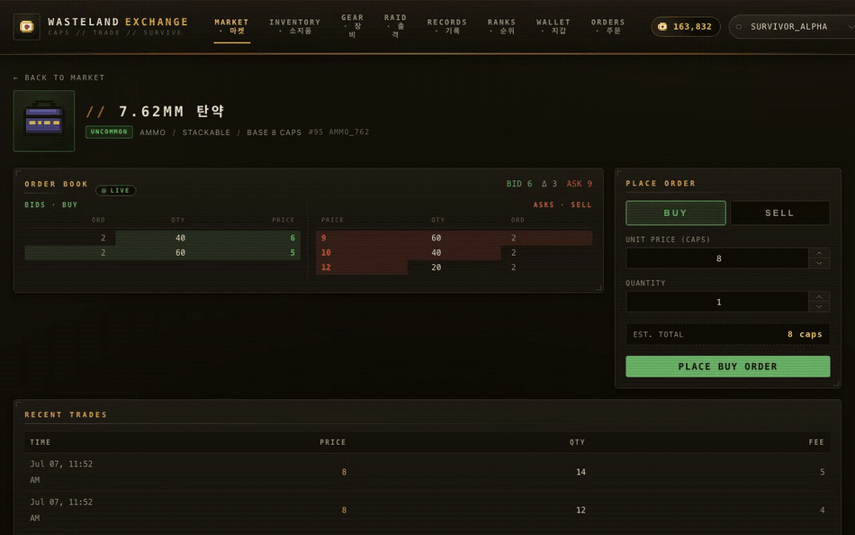</td>
<td>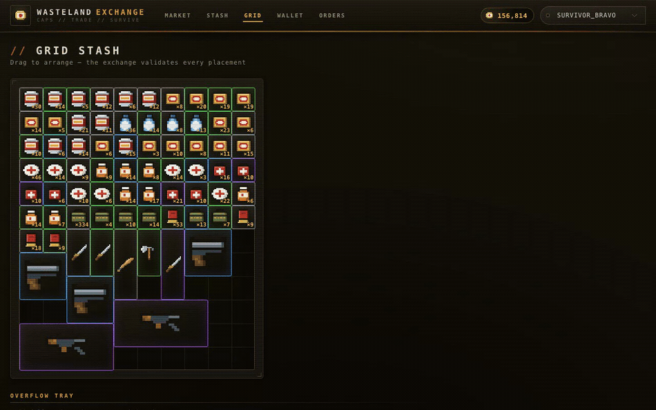</td>
</tr>
<tr>
<td colspan="2"><b>경제 엔진 — 익스트랙션 레이드 루프</b> — 존을 골라 <b>수수료</b>를 내고 출격, 루팅할수록 <b>사망확률이 오르고</b> 탈출 성공률이 떨어집니다("한 상자 더 vs 지금 탈출"). 여기서 나온 전리품이 거래소로 유입됩니다.</td>
</tr>
<tr>
<td colspan="2">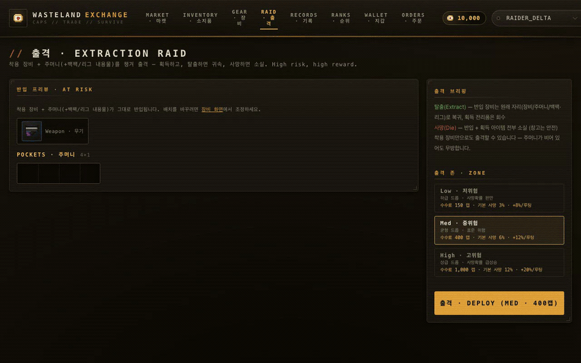</td>
</tr>
</table>

---

## 이 프로젝트로 증명하는 것 (엔지니어링 역량)

- **동시성 설계 (거래소 핵심)** — Orleans 단일 활성화 + 턴 기반으로 아이템별 매칭을 **락 코드 0줄**로
  직렬화. "단일 재고 1개에 동시 매수 8건 → 정확히 1건 체결, dupe 0"을 통합 테스트로 증명.
- **트랜잭션 · 데이터 정합성** — 주문 시점 **에스크로**(자산 잠금) + 체결 **단일 Postgres 트랜잭션**
  원자 정산. 부하 후 SQL 불변식으로 `발행 = 지갑+에스크로+소각`(diff 0)·아이템 보존·음수잔액 0 검증.
- **성능 분석 · 최적화** — 직접 만든 부하 도구([`tools/LoadTest`](tools/LoadTest))로 측정 →
  **교차-grain 지갑 락 순서 데드락(40P01) 발견 → 락 정렬로 p99 973→175ms(5.5×)**, 핫그레인 가격밴드
  샤딩으로 처리량 2.2× ([`docs/perf-report.md`](docs/perf-report.md)).
- **분산 시스템** — Orleans 클러스터링(Postgres 멤버십)으로 다중 실로, SignalR + **Redis 백플레인**으로
  인스턴스 간 실시간 푸시를 ON/OFF 대조로 실증.
- **보안 · 견고성** — 감사 중 **병뚜껑 무한발행 취약점(정수 오버플로) 발견·차단**, JWT +
  리프레시 토큰(로테이션·재사용 탐지), 주문 멱등성, 레이트 리미팅.
- **도메인 상태머신 · 원자 정산 (경제 엔진)** — 익스트랙션 세션(`RaidSessionGrain`)의 출격/탈출/사망
  전이를 각각 단일 Postgres 트랜잭션으로 정산, 총량 보존·스태시 불가침을 불변식 테스트로 고정.
- **설계 판단 · 트레이드오프** — "MSA 대신 Orleans", "Orleans Tx 대신 DB Tx", "fungible엔 per-unit
  UUID를 안 붙이는 이유" 등을 **근거와 함께** 선택·문서화.
- **품질 · 운영** — Testcontainers 기반 통합 테스트 우선(총 124개) · CI · Docker 한 방 실행 · Swagger ·
  어드민 GM 툴 · 풀스택(Vue 3).

> 면접용 Q&A·STAR 스토리·화이트보드 요약: **[`docs/interview-prep.md`](docs/interview-prep.md)**

---

## 아키텍처

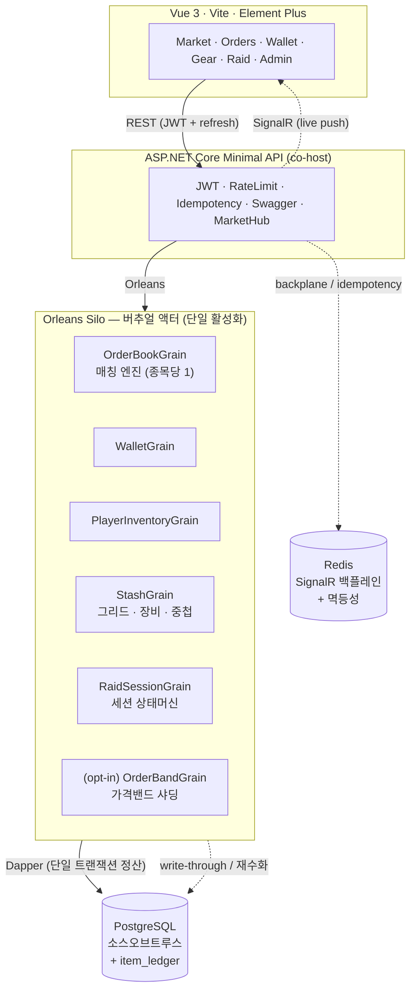

- **인메모리 호가창 = 재구성 가능한 투영**: 모든 변경은 같은 트랜잭션으로 DB write-through, 활성화 시
  DB에서 재수화 → 실로 장애/유휴 비활성화에도 무손실. **DB가 최종 진실**. 그레인을 **강제 비활성화한 뒤
  DB에만 넣은 주문이 재수화 스냅샷에 나타나고 매칭이 이어짐**을 회귀 테스트로 증명(`CrashRecoveryTests`).
- **다중 인스턴스**: Orleans가 grain을 실로에 분산, SignalR은 Redis로 인스턴스 간 푸시 중계.

### 매칭 · 정산 시퀀스 (거래소 핵심 경로)

주문 하나가 들어와 체결·정산·실시간 푸시까지 가는 길. **단일 활성화가 매칭을 직렬화**하고, **정산은
한 트랜잭션 안에서 원자적**이며, 인메모리 호가창은 **커밋 후에만** 반영된다(실패 시 재수화).

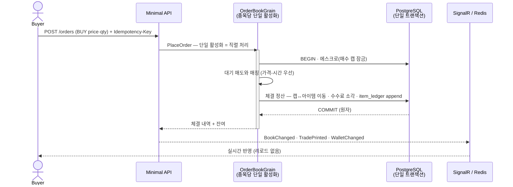

---

## 스크린샷

| | |
|---|---|
| **마켓** — 카탈로그 149종·실시간 시세·호가창 진입 | **아이템 상세** — bid/ask 래더·체결·주문폼 |
| 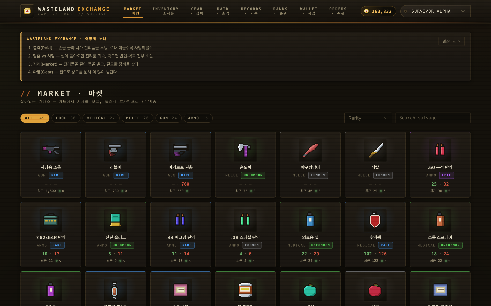 | 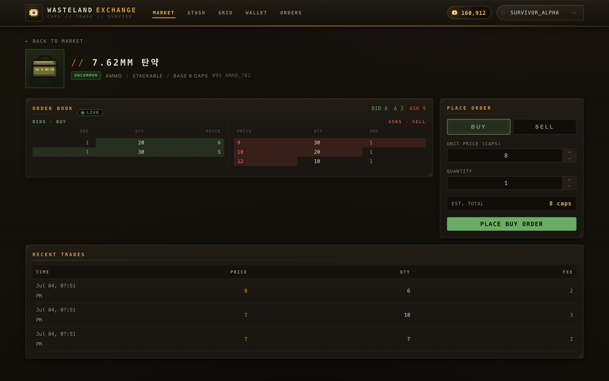 |
| **지갑** — 잔액 + append-only 원장 | **운영(GM) 콘솔** — admin 전용 |
| 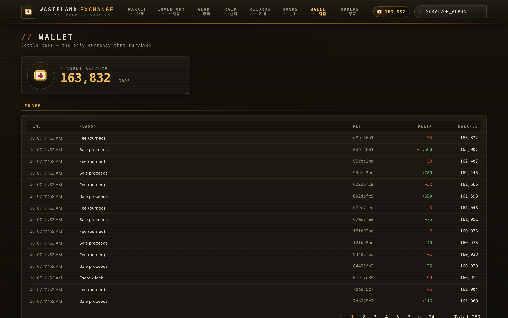 | 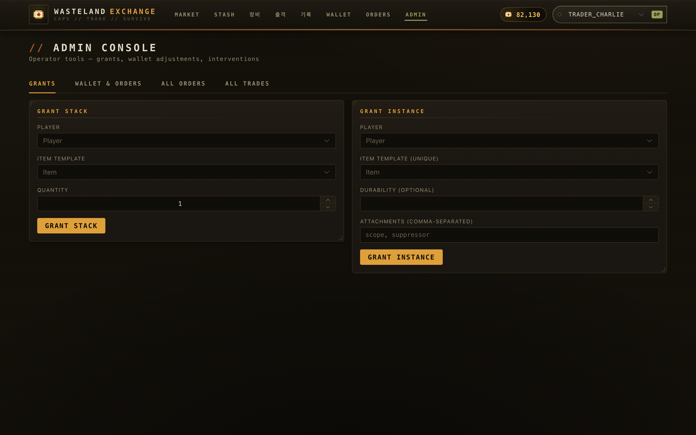 |
| **통합 장비(Gear)** — 스태시(12×가변)+장비 인형+주머니+리그·백팩 | **출격(Raid)** — 존 선택(수수료·사망확률)+at-risk 매니페스트 |
| 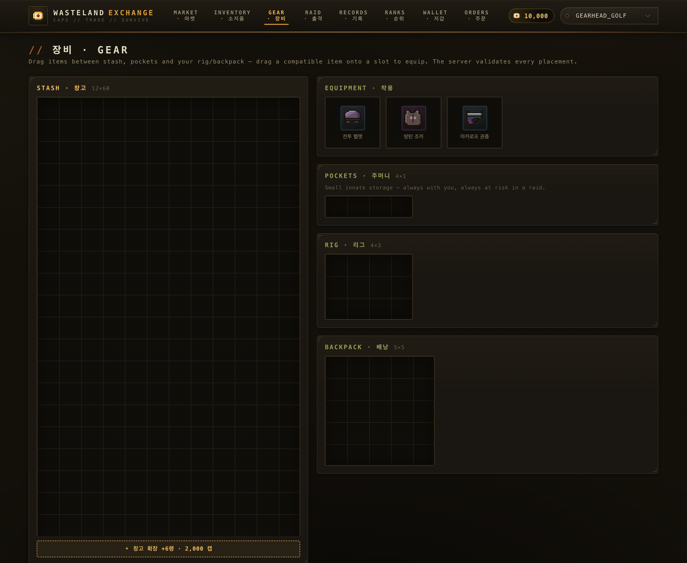 | 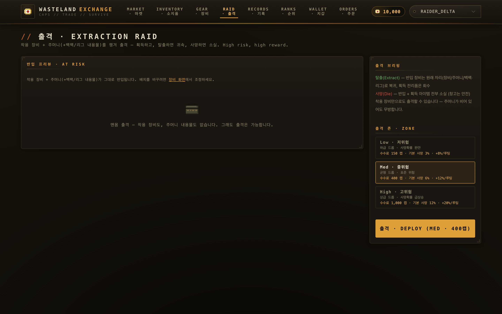 |
| **리더보드** — 최다 순자산·최다 생환 | **Swagger** — OpenAPI 문서 |
| 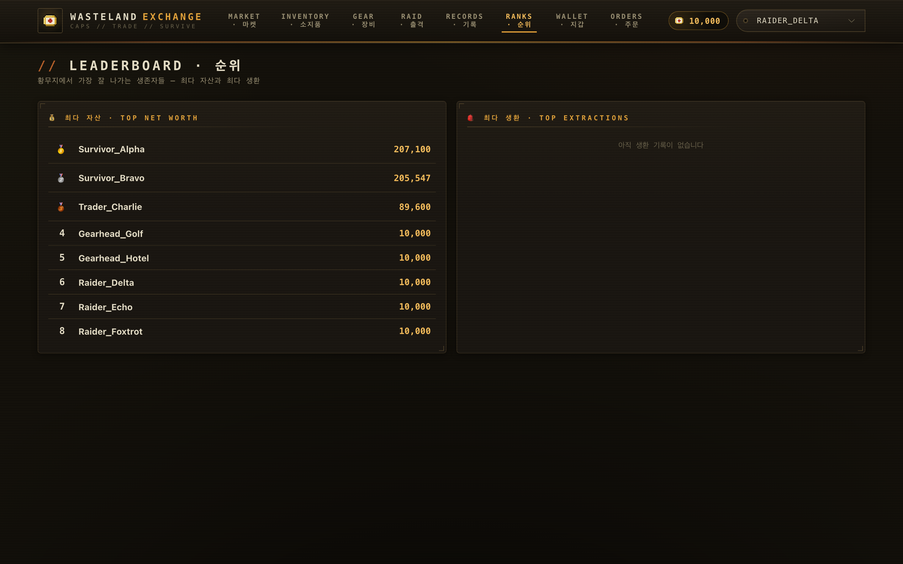 | 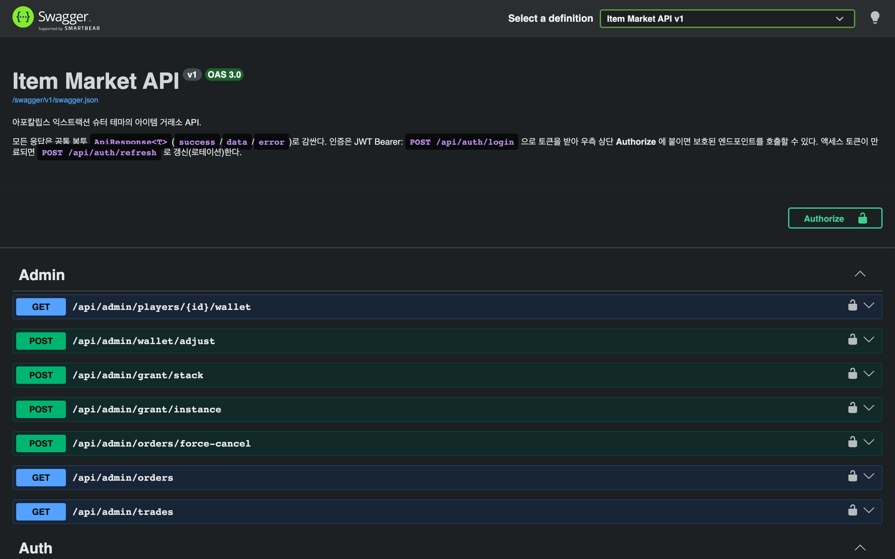 |

<sub>Vue 3 + Element Plus 다크 테마. Playwright로 재현 가능 — [`tools/screenshots`](tools/screenshots).</sub>

---

## 핵심 설계 결정 & 트레이드오프

| 결정 | 이유 (요약) |
|---|---|
| **MSA 대신 Orleans** | 거래소의 핵심 난제인 "동시 주문 경쟁"을 단일 활성화로 락 없이 해결. 브로커·디스커버리·배포 운영비용 없이 분산 문제(단일 활성화·위치 투명성·멤버십)만 취함 |
| **Orleans Tx 대신 단일 DB Tx** | 정산 대상이 전부 한 Postgres 안 → 분산 트랜잭션 불필요. SQL이 보여 락 순서·낙관적 가드를 통제·감사 가능 |
| **Dapper (네이티브 SQL)** | 정산 핫패스의 트랜잭션·락을 명시적으로. CRUD가 늘면 그 부분만 EF 하이브리드가 정석 |
| **가격밴드 샤딩은 opt-in** | 단일 종목의 엄격한 가격-시간 우선은 원리적으로 직렬 → 병렬화는 "밴드 격리 매칭" 트레이드오프를 감수해야 함(문서화) |
| **fungible엔 per-unit UUID 안 씀** | 탄약 1000발에 UUID 1000개는 "지폐 일련번호" 격. 출처는 `item_ledger`(append-only 이벤트)로 추적하고, 유니크 아이템만 인스턴스 UUID + `item_instance.origin`(SEED/RAID/RAID_LOST…)으로 프로버넌스 보존 |
| **Redis는 필요 시점에만** | 단일 인스턴스는 인메모리로 충분. 다중 인스턴스 실시간이 필요해질 때 백플레인으로 |

---

## 성능 · 정합성 (실측)

실제 **API→Orleans→PostgreSQL** 경로를 봇 클라이언트로 부하하고 SQL로 불변식을 검증했습니다
(M2 Pro, Release, 200 players·64 동시성 · 상세: [`docs/perf-report.md`](docs/perf-report.md)).

| 시나리오 | 처리량 | p99 | 비고 |
|---|---:|---:|---|
| spread (20종목 분산) | **1,411 orders/s** | 175 ms | 종목별 grain 병렬 |
| hot (단일 종목) | 350 orders/s | 257 ms | 단일 grain 상한 |
| hot + 가격밴드 샤딩 | **649 orders/s** | 189 ms | 단일 grain 상한 2.2× 돌파 |

- **데드락 발견→수정→재측정**: 교차-grain 지갑 락 순서 경합(40P01)으로 튀던 spread p99를
  `playerId` 순 락 정렬로 **973 → 175ms (5.5×)**, 데드락 0.
- **정합성 불변식 전 항목 PASS**: 수만 건 동시 체결에도 병뚜껑·아이템 보존, 음수잔액 0.

### 발견하고 고친 결함 (문제 해결)
자체 감사로 잡은 것 — **문제→원인→해결→회귀 테스트**. 전체: [`docs/backend-audit.md`](docs/backend-audit.md).
1. **병뚜껑 무한발행(Critical)** — `단가×수량` 정수 오버플로가 음수 에스크로로 지갑에 돈을 꽂음 →
   Int128 검증+상한으로 차단.
2. **에스크로 후 주문 INSERT 실패 시 자산 증발(Critical)** — 보상 트랜잭션으로 원복.
3. **정산 실패가 호가창 오염(Critical)** — 커밋 후에만 인메모리 반영 + 실패 시 재수화.
4. **자전거래·교차-grain 데드락·그리드 제약 버그·DnD DataCloneError** 등 — 각각 수정+테스트.

---

## 경제 엔진 — 익스트랙션 루프 (거래소를 살아있게 하는 수요·공급)

거래소가 진공에서 놀지 않도록, 아이템의 **공급원(faucet)·소각처(sink)** 를 서버 권위·원자성으로
모델링했습니다. 게임플레이 틱/전투는 범위 밖 — 이 백엔드는 게임 서버가 호출하는 서비스이며
`extract`/`die`는 명시적 계약(엔드포인트)입니다.

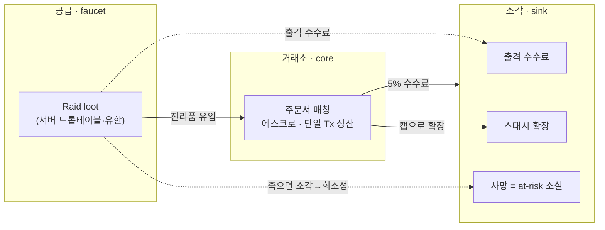

**세션 상태머신** — 플레이어당 ACTIVE 1개(부분 유니크 인덱스로 강제), 각 전이는 단일 Postgres 트랜잭션:

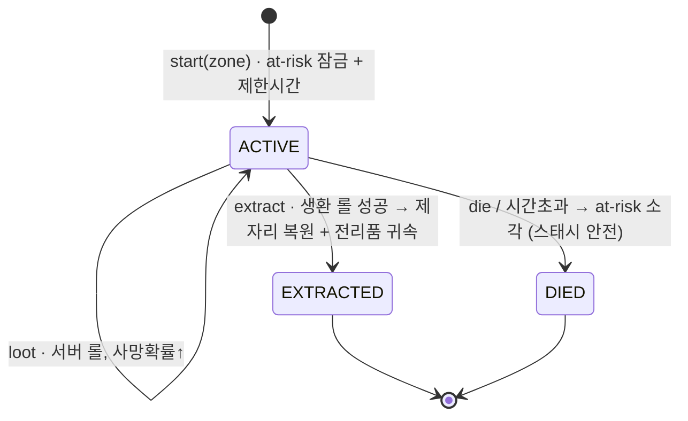

- **at-risk = 스태시 밖 전부**: 반입 대상은 착용 장비(헬멧/방어구/무기/백팩/리그) + 백팩·리그 **내용물** +
  주머니. **착용 장비만 있어도 출격 가능**. **스태시(안전)는 절대 at-risk가 아님**. 매도 에스크로의
  "자산 잠금"을 그대로 재사용한다.
- **리스크/보상 존**: 출격 시 **Scav/Low/Med/High** 선택 — 존이 서버 드롭테이블의 rarity 가중치, loot당
  사망확률 상승률, 기본 사망확률(floor), 출격 수수료를 함께 결정. 무료 **Scav**는 최저 EV·최저 드롭의
  재기용 진입 티어(수수료 0). 루팅은 서버가 존 가중치로 롤(클라 무한 인플레 차단).
- **불변식**: 탈출은 **반입 자산을 출격 전 자리 그대로 복원**하고 전리품을 귀속(총량 보존), 사망은
  at-risk만 소실하고 **스태시는 불가침**. 모든 이동은 append-only `item_ledger`로 프로비넌스 회계.
  통합 테스트로 고정.

> 그리드 인벤토리·중첩 컨테이너의 DB 설계(단일 `stash_placement` 테이블 + 자기참조 FK로 가방-안-가방
> 표현, 셀 유일성·NULL 접기, at-risk 한 방 쿼리)는 **[`docs/api-contract.md`](docs/api-contract.md)** 와
> `db/ddl.sql` 참고.

---

## 실행 방법

사전 조건: **.NET 10 SDK**, **Docker**, **Node 20+**, `jq`(시드용).

```bash
# A) Docker 한 방 — 전체 스택 (postgres+redis+api+web)
docker compose --profile app up -d --build
#   web http://localhost:8081 · api http://localhost:8080 (/swagger) · DDL 자동 적용

# B) 로컬 개발 (핫리로드)
docker compose up -d                        # Postgres(+redis)만
dotnet run --project src/ItemMarket.Api     # API http://localhost:5080 (/swagger)
cd web && npm install && npm run dev         # Web http://localhost:5173

# 살아있는 마켓 데이터
./scripts/seed-market.sh && ./scripts/seed-trades.sh

# 테스트 (Docker만 있으면 됨 — 일회용 Postgres 자동)
dotnet test                                  # 124개: 단위 41 + 통합 79 + 밴딩 4

# 다중 실로 + Redis 실시간 데모
./scripts/run-cluster.sh
```

로그인(데모, 비밀번호 없음): `Survivor_Alpha` · `Survivor_Bravo` · `Trader_Charlie`(admin).

---

## 테스트

Testcontainers Postgres + `WebApplicationFactory`로 **실제 API+Orleans+DB를 목킹 없이** 검증하는
통합 테스트 우선 전략. 커버: 원자 정산·수수료 소각, 부분 체결, 에스크로 환불, **동시 매수 단일 체결**,
정수 오버플로 거부, 자전거래 스킵, 멱등성, 레이트리밋 429, 리프레시 로테이션/재사용 401, 그리드 배치·
컨테이너 간 이동·다중 스택 분할/병합·장비 착용/해제, **레이드 세션 정산**(출격/탈출-제자리복원/사망
불변식·총량 보존), 가격밴드 격리. 순수 로직(기하·수수료)은 DB 없는 단위 테스트.

---

## 기술 스택

| 스택 | 역할 / 이유 |
|---|---|
| **C# / .NET 10 · ASP.NET Core Minimal API** | 게임 서버 표준 언어. 엔드포인트-그레인 배선을 얇게 |
| **Microsoft Orleans** | 매칭 동시성을 단일 활성화로 락 없이 해결(게임 백엔드 검증 프레임워크) |
| **PostgreSQL · Dapper** | 돈·아이템 소스오브트루스, 정산은 단일 SQL 트랜잭션 + 낙관적 가드 |
| **SignalR · Redis** | 실시간 호가/체결 푸시, 다중 인스턴스 백플레인 |
| **JWT (+refresh, rotation)** | 무상태 인증, 짧은 액세스 + 해시 저장 리프레시 |
| **Vue 3 · TS · Element Plus** | 운영 툴 포함 프론트, C# DTO를 TS로 미러링해 계약 강제 |
| **Testcontainers · GitHub Actions · Docker** | 통합 테스트 우선 · CI 게이트 · 한 방 실행 |

---

## 프로젝트 구조 & 문서

```
src/ItemMarket.Contracts/   # 프론트/백 공유 계약(DTO)
src/ItemMarket.Grains/      # Orleans grain(매칭/지갑/인벤/스태시/레이드/밴드) + Dapper 리포지토리
src/ItemMarket.Api/         # Minimal API + 실로 co-host, JWT/리프레시, SignalR, Swagger, 어드민
web/                        # Vue 3 프론트 + 픽셀 스프라이트
db/ · tests/ · tools/ · scripts/ · docs/ · Dockerfile · docker-compose.yml · .github/
```

- [`docs/interview-prep.md`](docs/interview-prep.md) — 면접 Q&A·STAR·JD 매핑
- [`docs/api-contract.md`](docs/api-contract.md) · [`docs/realtime-contract.md`](docs/realtime-contract.md) — REST/실시간 계약
- [`docs/backend-audit.md`](docs/backend-audit.md) — 자체 감사(결함→수정→테스트)
- [`docs/perf-report.md`](docs/perf-report.md) — 부하 테스트·병목 분석
- [`docs/qa-report.md`](docs/qa-report.md) — QA 패스(기능+플레이테스트) 발견 이슈·개선 백로그

---

## 한계 & 다음 스텝 (스코프 명시)

포트폴리오 스코프라 의도적으로 남긴 부분 — 확장 방향까지 인지하고 있습니다.
- **초점**: 이 프로젝트의 중심은 **아웃게임 거래소**입니다. 레이드는 경제에 수요/공급을 만드는 얇은
  엔진으로 유지하며(실제 전투/루팅은 서버 드롭테이블 시뮬레이션), 게임성 자체를 깊게 파지 않습니다.
- **인증**: 데모 로그인은 비밀번호가 없음. 실서비스는 자격증명·비대칭키·시크릿 매니저·폐기 리스트 필요
  (토큰 단위 폐기용 `jti`는 이미 발급).
- **성능 수치**: 단일 노드 측정 → 절대치보다 상대 비교·불변식이 핵심 산출물.
- **관측성**: 구조적 로깅은 있으나 메트릭/트레이싱(OpenTelemetry)은 로드맵.
- **거래소 심화 방향**: 시장 심도(depth) 뷰, 캔들/차트, 부분 취소·정정 주문, 다중 노드 매칭 벤치.
- **경제 엔진 확장 방향**: 보험, 그리드 회전, 아이템 내구도/수리, 이상거래(RMT) 탐지.
