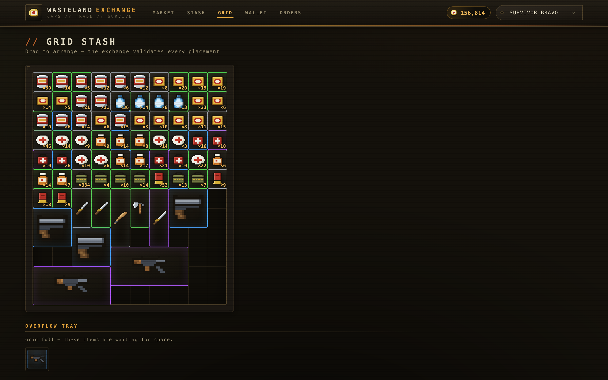

# Wasteland Exchange — 아이템 거래소 (게임 서비스 백엔드)

<!-- CI 배지: 원격 저장소 push 후 <OWNER>/<REPO> 를 실제 슬러그로 바꾸세요. -->
[](https://github.com/<OWNER>/<REPO>/actions/workflows/ci.yml)

> 아포칼립스 익스트랙션 슈터 장르의 **서버 권위(server-authoritative) 아이템 거래소**.
> 주문서 매칭 엔진 · 에스크로 · 원자적 정산 · 실시간 호가 · 그리드 인벤토리 · 운영(GM) 툴을
> 갖춘 게임 서비스 백엔드 포트폴리오입니다.

플레이어는 병뚜껑(CAP)을 재화로 아이템을 사고팝니다. 매수/매도 주문은 **가격-시간 우선순위**로
매칭되고, 체결 시 아이템·재화·수수료가 **하나의 Postgres 트랜잭션으로 원자 정산**됩니다.
먹을거/힐템/탄약은 수량 기반 **스택**으로, 근접무기/총은 내구도·부착물을 가진 **유니크 인스턴스**로
거래됩니다(아포칼립스 세계관이라 총은 귀합니다).

---

## 스크린샷

> 시드된 라이브 마켓(주문·체결) 화면. Vue 3 + Element Plus 다크 테마.
> 캡처는 Playwright로 재현 가능 — [`tools/screenshots`](tools/screenshots).

### 마켓 카탈로그 — 아이템 102종 · 픽셀 스프라이트 · 등급
아이템 카드 그리드. 카테고리 필터(FOOD/MEDICAL/MELEE/GUN/AMMO)와 등급 배지, 최저 매도가 표시.


### 아이템 상세 — 호가창 · 체결 이력 · 주문 폼
7.62mm 탄약의 매수/매도 **호가 래더**(가격-수량-주문수), 실시간 스프레드, 우측 매수/매도 주문 폼,
하단 **최근 체결**(가격·수량·수수료).


### 그리드 스태시 — 타르코프식 footprint 인벤토리
10×12 스태시. 아이템 footprint(권총 2×1, AK-47 등 총기 4×2)와 스택 수량, 자리가 없어 대기 중인
오버플로 트레이. 드래그앤드롭 배치는 서버가 검증.



### 지갑 — 병뚜껑 잔액 + append-only 원장
현재 잔액과 원장 타임라인(판매 대금 / 수수료 소각 / 에스크로 락 등, delta·running balance).


### 운영(GM) 콘솔 — admin 롤 전용
아이템 지급(스택/유니크 인스턴스), 지갑 조정, 주문 강제 취소, 전체 주문·체결 조회 탭.


### API 문서 — Swagger / OpenAPI
`ApiResponse<T>` 공통 래핑 규약과 JWT Bearer 인증, 엔드포인트 전체.


---

## 기능 한눈에

| 영역 | 내용 |
|---|---|
| **거래소** | 주문서(order book) 매칭 엔진(가격-시간 우선, 부분 체결), 매수/매도 **에스크로**, 체결 **원자 정산**(대금·수수료 소각·아이템 이전·차익 환불), append-only **지갑 원장** |
| **아이템** | 아이템 마스터 **102종**(먹을거·힐템·근접무기·총·탄약), 하이브리드(스택형 / 유니크 인스턴스), **픽셀 스프라이트 15종** |
| **그리드 인벤토리** | 타르코프식 **10×12 스태시** — 아이템 footprint(예: AK-47 4×2), **드래그앤드롭 이동**, **서버 권위 배치 검증**(경계·겹침), first-fit 자동 배치 |
| **실시간** | **SignalR**로 호가창·체결·지갑 라이브 푸시(폴링 제거), 다중 인스턴스는 **Redis 백플레인** |
| **인증/인가** | **JWT(HS256) + 리프레시 토큰**(로테이션·재사용 탐지), 롤 기반 어드민 인가 |
| **운영(GM) 툴** | 아이템 지급, 병뚜껑 조정, 주문 강제 취소, 전체 주문/체결 조회 (admin 롤) |
| **견고성** | 주문 **멱등성**(Idempotency-Key), **레이트 리미팅**, 정합성 불변식 |
| **문서/품질** | Swagger/OpenAPI, 통합·단위 테스트 **65개**, 부하테스트, 자체 감사 리포트, CI |

프론트 화면: **Market**(카탈로그·호가창·주문) / **Grid**(그리드 스태시) / **Inventory** / **Wallet**(+원장) / **My Orders** / **Admin**.

---

## 아키텍처

```
          ┌──────────── Vue 3 (Vite + Element Plus) ────────────┐
          │  Market · Grid Stash · Wallet · Orders · Admin       │
          └───────┬──────────────────────────────┬──────────────┘
             REST │ (JWT + refresh)      SignalR  │ (live push)
          ┌───────▼──────────────────────────────▼──────────────┐
          │        ASP.NET Core Minimal API  (co-host)           │
          │  JWT 인증 · 레이트리밋 · 멱등성 · Swagger · MarketHub  │
          └───────────────────────┬──────────────────────────────┘
                                   │  Orleans (버추얼 액터)
          ┌────────────────────────▼─────────────────────────────┐
          │  OrderBookGrain(매칭엔진) · WalletGrain · Inventory     │
          │  StashGrain · (opt-in) OrderBandGrain(가격밴드 샤딩)     │
          └───────────────────────┬──────────────────────────────┘
                                   │  Dapper (단일 트랜잭션 정산)
                             ┌─────▼──────┐       ┌────────────────┐
                             │ PostgreSQL │       │ Redis           │
                             │(소스오브트루스)│    │(SignalR 백플레인· │
                             └────────────┘       │ 다중 인스턴스)   │
                                                  └────────────────┘
```

- **Orleans 단일 활성화**: 아이템 하나의 호가창 grain은 클러스터 전체에서 정확히 1개 + 턴 기반 →
  "한 아이템에 동시 주문 N건"이 **락 코드 0줄**로 직렬화(중복 체결·이중 판매 원천 차단).
- **다중 인스턴스**: Orleans는 Postgres(ADO.NET) 멤버십으로 클러스터를 구성, SignalR은 Redis
  백플레인으로 인스턴스 간 라이브 푸시를 중계.

---

## 실행 방법

사전 조건: **.NET 10 SDK**, **Docker**, **Node 20+**, `jq`(시드 스크립트용).

### A) Docker 한 방 — 전체 스택
```bash
docker compose --profile app up -d --build
#  web  → http://localhost:8081
#  api  → http://localhost:8080   (Swagger: http://localhost:8080/swagger)
#  postgres(5432) · redis(6379) 포함, DDL 자동 적용
```

### B) 로컬 개발 (핫리로드)
```bash
docker compose up -d                        # Postgres(+redis)만 기동, DDL 자동 적용
dotnet run --project src/ItemMarket.Api     # API  → http://localhost:5080  (/swagger)
cd web && npm install && npm run dev         # Web  → http://localhost:5173
```

### 살아있는 마켓 데이터 채우기
```bash
./scripts/seed-market.sh    # 마켓메이커 호가(전 스택형 3단 매도/2단 매수) + 유니크 무기 매물 + 스타터 키트
./scripts/seed-trades.sh    # 체결 이력(종목별 2~4건 + 유니크 무기)
```

### 로그인(비밀번호 없는 데모)
플레이어 스위처에서 선택: `Survivor_Alpha` · `Survivor_Bravo` · `Trader_Charlie`(**admin** — 운영 툴).

### 다중 실로 + Redis 실시간 데모
```bash
./scripts/run-cluster.sh    # 2개 인스턴스(adonet 클러스터링 + Redis 백플레인, 전용 DB/포트)
```

---

## 테스트

```bash
dotnet test        # 65개: 단위 33 + 통합 28 + 밴딩 4  (Docker만 있으면 됨 — 일회용 Postgres 자동)
```
- **통합/밴딩**: Testcontainers Postgres + `WebApplicationFactory`로 실제 API+Orleans+DB를 목킹 없이 검증.
- 커버: 원자 정산·수수료 소각, 부분 체결, 에스크로 환불, **동시 매수 단일 체결**, 오버플로 거부,
  자전거래 스킵, 멱등성, 레이트리밋 429, 리프레시 로테이션/재사용 401, 그리드 배치 검증, 가격밴드 격리.

---

## 성능 · 견고성 하이라이트

실제 **API→Orleans→PostgreSQL** 경로를 봇 클라이언트로 부하하고, 동시성 하에서 **돈/아이템 보존
불변식**을 SQL로 검증했습니다. 도구: [`tools/LoadTest`](tools/LoadTest) · 분석: [`docs/perf-report.md`](docs/perf-report.md).

- **처리량/지연**(M2 Pro, Release, 200 players·64 동시성): spread **1,411 orders/s**(p99 175ms),
  hot 350 orders/s. spread ≈ hot의 4배(종목별 grain 병렬).
- **정합성 불변식 전 항목 PASS**: 수만 건 동시 체결에도 병뚜껑 보존(발행=지갑+에스크로+소각, diff 0)·
  아이템 보존·음수 잔액 0 — 정산이 단일 Postgres 트랜잭션이라 가능.
- **부하테스트로 데드락 발견 → 수정 → 재측정**: 교차-grain 지갑 락 순서 경합(40P01)으로 튀던
  spread p99를 **playerId 순 락 정렬**로 **973 → 175ms(5.5×)** 개선.
- **가격밴드 샤딩(opt-in)**: 핫 종목을 `(templateId, priceBand)`로 분할해 단일 grain 상한을
  **≈2.2× 돌파**(밴드-격리 매칭 트레이드오프 문서화).
- **다중 인스턴스 실시간**: 인스턴스 B의 REST가 인스턴스 A의 구독자에게 이벤트 전달됨을 Redis
  백플레인 ON/OFF 대조로 실증.

---

## 개발 중 만난 이슈와 해결 (요약)

포트폴리오 핵심이라 **문제→원인→해결→회귀 테스트**로 남겼습니다. 전체: [`docs/backend-audit.md`](docs/backend-audit.md).

1. **병뚜껑 무한 발행(Critical)** — `단가×수량` long 오버플로 → 음수 에스크로가 지갑에 돈을 꽂음.
   Int128 검증 + 상한으로 차단.
2. **에스크로 후 주문 INSERT 실패 시 자산 증발(Critical)** — 보상 트랜잭션으로 원복.
3. **정산 실패가 호가창 오염(Critical)** — 커밋 후에만 인메모리 반영 + 실패 시 재수화.
4. **자전거래 허용(High)** — 본인 주문 매칭 스킵.
5. **교차-grain 데드락** — 지갑 락 순서 정렬(위 성능 참조).
6. **그리드 유니크 제약 버그** — `uq_stash_stack`이 인스턴스에도 걸려 같은 무기 2정이 duplicate key →
   STACK 전용 **부분 유니크 인덱스**로 수정.
7. **드래그앤드롭 DataCloneError** — Vue 반응형 프록시를 `structuredClone` → 참조 스냅샷으로 교체.
8. **Orleans 직렬화/예약 설정 충돌**, **Element Plus 다크테마 미적용** 등.

---

## 프로젝트 구조

```
src/ItemMarket.Contracts/   # 프론트/백 공유 계약(DTO) — TS 타입으로 미러링
src/ItemMarket.Grains/      # Orleans grain(매칭엔진/지갑/인벤/스태시/밴드) + Dapper 리포지토리
src/ItemMarket.Api/         # Minimal API + 실로 co-host, JWT/리프레시, SignalR 허브, Swagger, 어드민
web/                        # Vue 3 프론트(마켓/그리드/지갑/주문/어드민) + 픽셀 스프라이트
db/ddl.sql                  # 스키마 + 아이템 마스터 102종 (docker 초기화 시 자동 적용)
db/orleans-clustering.sql   # Orleans ADO.NET 멤버십 테이블
tests/                      # UnitTests · IntegrationTests · BandingTests (65개)
tools/LoadTest/             # HTTP 부하 생성기 + SQL 불변식 검증
tools/gen-sprites.mjs       # ASCII 픽셀맵 → SVG 스프라이트 생성기
scripts/                    # 마켓/체결 시드, 다중 실로 기동
docs/                       # api-contract · realtime-contract · backend-audit · perf-report
Dockerfile · web/Dockerfile · docker-compose.yml · .github/workflows/ci.yml
```

---

## 기술 스택 & 선택 이유

| 스택 | 이유 |
|---|---|
| **C# / .NET 10 + ASP.NET Core Minimal API** | 게임 서버 표준 언어. 엔드포인트-그레인 배선을 얇게 |
| **Microsoft Orleans** | Halo 백엔드용 검증 프레임워크. 단일 활성화로 매칭 동시성을 락 없이 해결. MSA 운영비용 없이 분산 문제(단일 활성화·위치 투명성·멤버십) 처리 |
| **PostgreSQL + Dapper** | 돈/아이템의 소스오브트루스. 정산은 SQL 트랜잭션이 가장 단순·검증 가능. Orleans Tx 대신 단일 DB 트랜잭션 + 낙관적 동시성 가드 |
| **Redis** | SignalR 백플레인(다중 인스턴스 실시간). 필요해지는 시점에만 도입(config 스왑) |
| **JWT + 리프레시 토큰** | 무상태 인증, 짧은 액세스(15분)+긴 리프레시(14일, 해시 저장·로테이션·재사용 탐지) |
| **Vue 3 + TS + Element Plus** | 운영 툴 포함 프론트를 빠르게. C# DTO를 TS로 미러링해 계약 강제 |
| **Testcontainers + WebApplicationFactory** | 통합 테스트 우선 — 일회용 DB + 실제 호스트로 목킹 없이 검증 |
| **Docker Compose + GitHub Actions** | 한 방 실행 + push마다 테스트 게이트 |

---

## 확장 로드맵

- **익스트랙션 세션 루프**: 레이드 반출 → 생존 시 스태시 귀속 / 사망 시 소실 → 전리품이 마켓으로
- **이상 거래 탐지**: `wallet_ledger` 기반 RMT/자전거래 휴리스틱 + 어드민 플래그
- **관측성**: OpenTelemetry 메트릭/트레이스 (경량)
- **그리드 확장**: 회전, 다중 컨테이너(백팩/리그)
